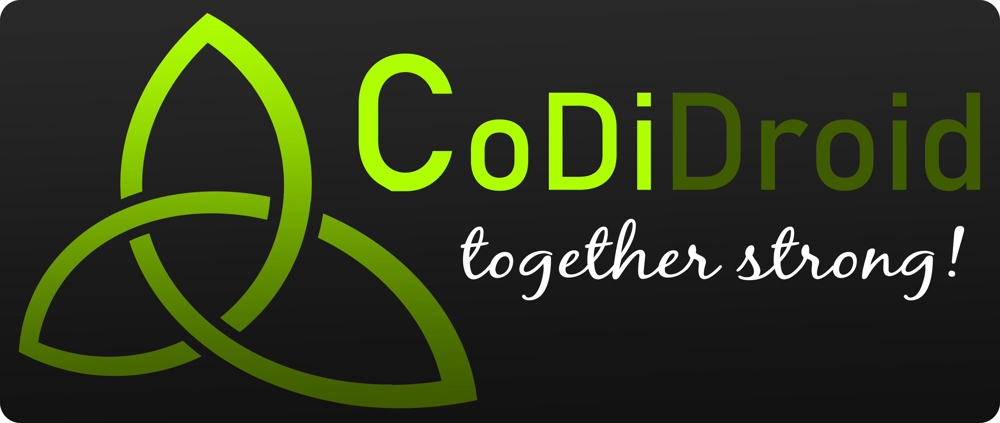
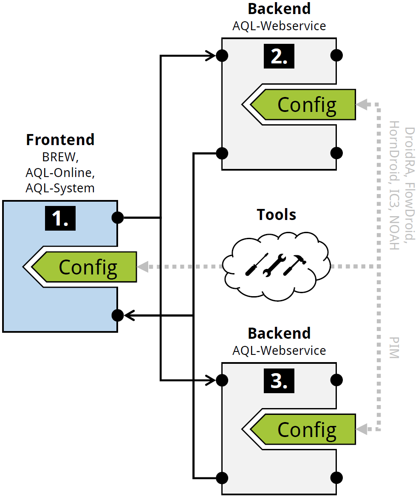

<p align="center">
	
</p>

# CoDiDroid
Along with the paper *Together Strong: Cooperative Android App Analysis* (see [Publications](#Publications)) we developed CoDiDroid, a **co**operative (and **di**stributed) An**droid** app analysis tool framework.
It represents an instance of a network of analysis tools build by setting up different [AQL-WebServices](https://github.com/FoelliX/AQL-WebService).  
The figure below gives a brief overview of this instance:

<p align="center">
	
</p>

The analysis tools available in the community can be found in the center of the figure.
The frontend <font style="color: #FFFFFF; background: #000000; padding: 1px 7px 1px 5px; font-weight: bold;">1.</font> , which allows to access CoDiDroid, can be realized by any AQL (Android App Analysis Query Language) interface such as [BREW](https://github.com/FoelliX/BREW), [AQL-Online](https://github.com/FoelliX/AQL-Online) or an [AQL-System](https://github.com/FoelliX/AQL-System).
Two [AQL-WebServices](https://github.com/FoelliX/AQL-WebService) form the backend.
Each is setup to execute different analysis tools.
On the one hand, WebService <font style="color: #FFFFFF; background: #000000; padding: 1px 7px 1px 5px; font-weight: bold;">2.</font> is configured to run [DroidRA](https://github.com/serval-snt-uni-lu/DroidRA), [FlowDroid](https://github.com/secure-software-engineering/FlowDroid), [HornDroid](https://github.com/ylya/horndroid), [IC3](https://github.com/FoelliX/ic3) and [NOAH](https://github.com/FoelliX/NOAH).
On the other hand, WebService <font style="color: #FFFFFF; background: #000000; padding: 1px 7px 1px 5px; font-weight: bold;">3.</font> holds only one tool in its configuration, namely [PIM](https://github.com/FoelliX/PIM).

Whenever a query is issued by the frontend the most suitable tool or tool combination is execute by one or both backends.
Once a partial or the complete answer to the query or parts of it are computed the frontend receives these answers.
The communication between the different systems is realized through a REST API.

### Example
While answering the following exemplary query different tools are triggered:

```
MATCH [
	Flows IN App(’A.apk’ | ’DEOBFUSCATE’) ?,
	CONNECT [
		Flows IN App(’B.apk’ | ’UNCOVER’) ?,
		Flows IN App(’B.apk’ | ’UNCOVER’) FEATURING ’NATIVE’ ?
	],
	IntentSources IN App(’A.apk’ | ’DEOBFUSCATE’) ?,
	IntentSinks IN App(’A.apk’ | ’DEOBFUSCATE’) ?,
	IntentSources IN App(’B.apk’ | ’UNCOVER’) ?,
	IntentSinks IN App(’B.apk’ | ’UNCOVER’) ?
]
```

The `MATCH` operator is bound to PIM which deals with the computation of the final answer by combining all information gathered by the questions inside its scope `[...]`. The preprocessor keyword `'DEOBFUSCATE'` leads to the execution of DroidRA in order to resolve reflective statements in app `A.apk`. The keyword `'UNCOVER'` as well as the feature `'NATIVE'` is related to NOAH. NOAH helps uncovering flows in native code. All questions asking for flows are answered by FlowDroid by default. Information about IntentSources and -Sinks are computed by IC3.

The complete example as well as its results are explained in the associated paper (see [Publications](#Publications)).

## Evaluation Eesults
The evaluation result computed by CoDiDroid for the associated paper (*Together Strong: Cooperative Android App Analysis*) can be downloaded here:
- RQ1: [RQ1_results.zip](https://my.hidrive.com/lnk/8giZrELM)
- RQ2: [RQ2_results.zip](https://my.hidrive.com/lnk/ZzC5rVjH)
- RQ3: [RQ3_results.zip](https://my.hidrive.com/lnk/Y2i5LnCO)

## Publications
- *Together Strong: Cooperative Android App Analysis* (Felix Pauck, Heike Wehrheim)  
t.b.a.

## Contact
**Felix Pauck** (FoelliX)  
Paderborn University  
fpauck@mail.uni-paderborn.de  
[http://www.FelixPauck.de](http://www.FelixPauck.de)